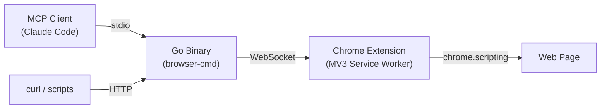
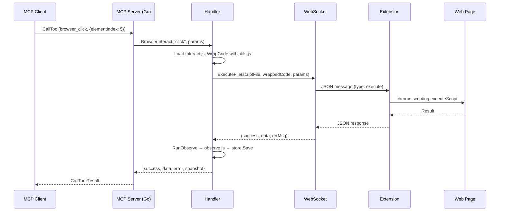

# Architecture: browser-mcp-extension

## System Overview

Three-layer browser automation system: Go binary orchestrates commands, Chrome Extension executes them in web pages.



## Run Modes

The binary (`main.go`) supports two modes:

- **`--mcp`**: MCP server on stdio. AI agents communicate via Model Context Protocol.
- **default**: HTTP API on `127.0.0.1:HTTP_PORT` + WebSocket server on `127.0.0.1:WS_PORT`.

Both modes share the same setup: config → observation store → WebSocket connection → handler.

## Project Structure

```
main.go                          Entry point (--mcp vs serve)
internal/
  config/config.go               Env var loading, validation, path resolution
  mcp/
    server.go                    MCP server init, stdio wiring
    tools.go                     MCP tool definitions and handlers (19 tools)
    resources.go                 MCP resource definitions
  api/
    handler.go                   HTTP routes, script execution, observe pipeline
    handler_browser.go           Screenshot, tabs, form fill, interact dispatch
    types.go                     Function type definitions (ExecuteFn, TabsFn, etc.)
  observation/
    store.go                     Snapshot persistence (RWMutex-protected, memory + optional disk)
  ws/
    connection.go                WebSocket client management (Mutex-protected, single connection)
extension/
  background.js                  Service worker: WS connect/reconnect, message dispatch, tab mgmt
  manifest.json                  MV3 manifest
  popup.html / popup.js          Config UI (port, token)
  wrap-scripts.sh                Wraps JS scripts + utils into extension/scripts/
resources/
  js_lib/utils.js                Shared utilities (type, click, hover with human-like event simulation)
  js_scripts/                    Automation scripts (observe, interact, click, navigate, etc.)
test/
  e2e/                           Separate Go module with playwright-go + MCP client
    helpers_test.go              Test infrastructure (MCP client, playwright setup)
    testdata/pages/              HTML test fixtures
```

## Data Flow

### MCP tool call (e.g. `browser_click`)



### Script wrapping

`WrapCode()` in `handler.go` wraps every script as:
```
(async function(params) {
  <utils.js library code>

  <script code>
})(paramsJSON)
```

This provides shared utilities (`wait`, `randomDelay`, `type`, `click`, `hover`) to every script.

## Key Design Decisions

### Dependency injection via function types
Handler receives `ExecuteFn`, `ExecuteFileFn`, `ScreenshotFn`, `TabsFn` as constructor parameters — not the WebSocket connection directly. This decouples the API layer from transport.

### Single WebSocket connection
Only one Chrome extension connects at a time. `Connection` uses `sync.Mutex` for send/receive serialization and `atomic.Pointer` for the ready channel (avoids data race during reconnection).

### Path resolution
Binary resolves JS scripts relative to the executable location (not CWD). This ensures MCP mode works when Claude Code launches the binary from any directory. Overridable via `JS_SCRIPTS_PATH`.

### Observation pipeline
After every interaction tool, `RunObserve()` automatically executes `observe.js` to capture the new page state. Snapshots are stored in memory (latest only) with optional disk persistence.

### Security
- HTTP API binds to `127.0.0.1` only (loopback).
- WebSocket binds to `127.0.0.1` only.
- Optional bearer token for WebSocket auth (`WS_TOKEN`).
- Script path traversal protection in `ExecuteScript()`.
- URL scheme validation (http/https only) for navigation and tab creation.

## Concurrency Model

| Component | Protection | Notes |
|---|---|---|
| `ws.Connection` | `sync.Mutex` | Serializes send/receive; `atomic.Pointer` for ready channel |
| `observation.Store` | `sync.RWMutex` | Concurrent reads, exclusive writes |
| WS server | `sync.Mutex` (`connMu`) | Guards `connected` flag for single-connection enforcement |
